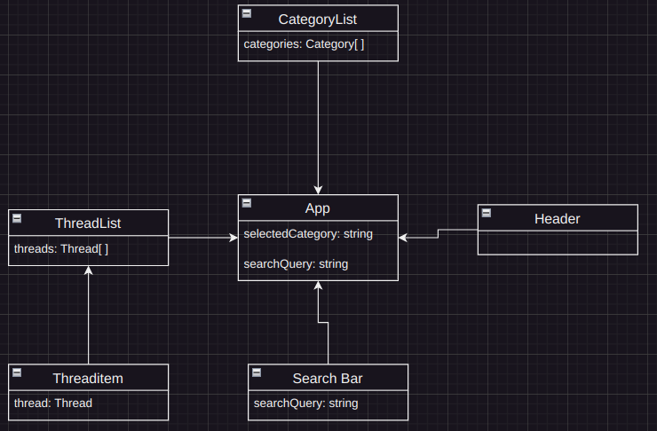

# Project_M294_Forum
## Table of Contents

## Project idea
Bomba-cat and I are building a simple forum for a School project where users can create threads and post replies without needing to log in or create accounts. The goal is to keep the platform easy to use, allowing quick participation in discussions. if we have enough time Users can browse threads. We want Users to add their thoughts to existing Threads. Our focus is on basic functionality, making sure everything works smoothly with React.js and API integration.

## Requirements
**1. Thread Creation**
Users can create new threads by adding a title and description for various topics.

**2. Posting Replies**
Users can reply to existing threads, sharing their opinions or asking questions within the discussion.

**3. Viewing Threads**
All created threads will be displayed on the main page of the forum, sorted by creation date or another logical order.

**4. Viewing Replies**
Users can view the replies and posts within a thread, allowing them to follow and engage in the conversation.

**5. Category Navigation (optional)**
Threads can be organized into categories, enabling users to browse and select specific areas of interest.

## Class Diagram

## User Story
### Forum Thread
As a User i want to create a Forum Thread in a category so i can start a discussion  
**Acceptance Criteria:**  
- As a User can click on Create Thread button
- A Form is displayed to input the Title, category and content
- The thread is displayed in the selected Category after he is finished
- Validate if the required fields are filled in
- User sees if the creation was successfull
### View Threads
As a User, I want to view a list of all Threads of a category the User selected 
**Acceptance Criteria**  
- Display a list of all threads in a selected category, sorted by the most recent (bonus)
- Each Thread shows his title and the time it was created
- Clicking on a Thread takes the user to the Thread itself
### Post a Reply
As a User, I want to be able to post a reply to an existing thread so i can talk to the community and join the discoussion  
**Acceptance Criteria**  
- A reply form is visible after the thread
- Users can input their reply and submit it
- the reply is added to the thread and displayed by recent
- Validation ensures that the reply isn't empty
- Users see a success or error massage based on the outcome of their reply
### Delete my Threads
As a User i want to delete my Threads if i want to  
**Acceptance Criteria**  
- Users see an "Delete" button on Threads
- Clicking "Delete" shows a confirmation before removing the post from the Thread

## Storyboard
We made a storyboard how the website should look and feel  
**Figma Link**  
https://www.figma.com/community/file/1417835678721298054

## Priority Planning
### 1. Priority
- [ ] Basic Structure for the Files and components
### 2. Priority
- [ ] Basic Structure of the Site (Navigation system and Frontpage (Routes))
### 3. Priority 
- [ ] Connection to the backend
### 4. Priority
- [ ] User can create a Thread
### 5. Priority 
- [ ] User can create a comment and is visible
### 6. Priority 
- [ ] User can see the Thread at the frontpage
### 7. Piority
- [ ] User can Delete a Thread
### 9. Priority (Optional)
- [ ] Add Categories and sortable with Categories

## Testplan
we made a Testplan to ensure everything works as intended
| **TestID** | **Testname**                                 | **Requirements**                                                                        | **Testprocess**                                                    | **Expected outcome**                                                                                                       |
| ---------- | -------------------------------------------- | --------------------------------------------------------------------------------------- | ------------------------------------------------------------------ | -------------------------------------------------------------------------------------------------------------------------- |
| 1          | Create a Thread                              | API connection                                                                          | 1\. go to thread page 2\. write a Thread with title and content | Thread should be in Database with Title and content                                                                     |
| 2          | Thread cannot be empty                       | Threads are creatable                                                                   | 1\. Create a Thread with no content                             | Show an error massage, that Title and content cannot be empty                                                           |
| 3          | Most recent Thread is on top of the Homepage | There are multiple threads and Threads are creatable                                 | 1\. create a Thread 2\. Go to the Homepage                      | Your most recent Thread is on top                                                                                          |
| 4          | Comment a Thread                             | there is a Thread and is Clickable on the Homepage                                | 1\. click on a Thread 2\. write a comment                       | Your comment should appear in the Comments section                                                                         |
| 5          | Comment can’t be empty                       | There is a Thread and is Clickable on the Homepage and you can Create Comments | 1\. write an empty comment                                         | There should be an error massage, that the comment can’t be empty                                                          |
| 8          | Delete a Thread                              | Threads are creatable                                                                   | 1\. go to a Thread 2\. click the delete Button                  | There should be a warning before you delete it if you click yes it should delete it if you click cancel it should be there |
